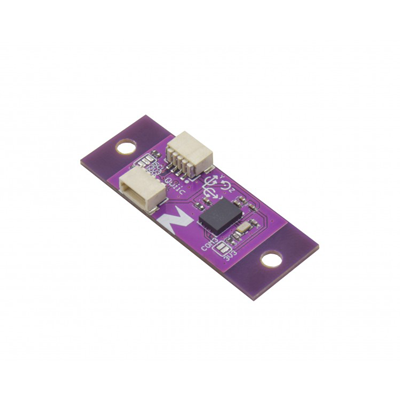

# Zio Qwiic 9DOF IMU BNO080

> This product can be available for purchase [here](https://www.smart-prototyping.com/Zio-9DOF-IMU-BNO080.html).

#### Description

This IC has a combination triple axis accelerometer/gyro/magnetometer packaged with an ARM Cortex M0+ running powerful algorithms. The BNO080 Inertial Measurement Unit (IMU) produces accurate rotation vector headings, excellently suited for VR and other heading applications with a static rotation error of 2 degrees or less. It’s what we’ve been waiting for: all the sensor data is combined and drift corrected into meaningful, accurate IMU information.

> Note: As with all of the Version 1.0 Zio Qwiic boards, this board has been produced with the I2C pull-ups disconnected by default. If there's a significant length of wire between this board and your MCU, you'll need to solder closed the solder jumpers (labeled SDA, 3v3 and SCL) to connect the pull-up resistors to VCC.

#### Specification

* Rotation Vector
  * Dynamic Error: 3.5°
  * Static Error: 2.0°
* Gaming Rotation Vector
  * Dynamic Error: 2.5°
  * Static Error: 1.5°
  * Heading Drift: 0.5° / min
* Geomagnetic Rotation Vector
  * Dynamic Rotation Error: 4.5°
  * Static Rotation Error: 3.0°
* Gravity Angle Error: 1.5°
* Linear Acceleration Accuracy: 0.35m/s2
* Accelerometer Accuracy: 0.3m/s2
* Gyroscope Accuracy: 3.1° / sec
* Magnetometer Accuracy: 1.4µT
* IC: BNO080
* I2C address: 0x4A, 0x4B (Default: 0x4A)
* Dimension: 13.9x 36.2mm(with mounting tab), 13.9x24.7mm(without mounting tab).
* Weight: 1.2g

#### Links

* [Eagle File and Schematic](https://github.com/ZIOCC/Qwiic_BNO080)
* [BNO080 Datasheet](https://www.smart-prototyping.com/image/data/NOA-RnD/101894%209DOF%20IMU%20BNO080/BNO080%20Datasheet%20v1.3.pdf)
* [SparkFun Library](https://github.com/sparkfun/SparkFun_BNO080_Arduino_Library)

> ###### About Zio
> Zio is a new line of open sourced, compact, and grid layout boards, fully integrated for Arduino and Qwiic ecosystem. Designed ideally for wearables, robotics, small-space limitations or other on the go projects. Check out other awesome Zio products [here](https://www.smart-prototyping.com/Zio).

> All Zio products are released under the [Creative Commons Attribution, Share-Alike License](https://creativecommons.org/licenses/by-sa/4.0/), and in accordance with the principles of the [Open Source Hardware Association's OSHW Statement of Principles 1.0 and OSHW Definition 1.0](https://www.oshwa.org/definition/).
